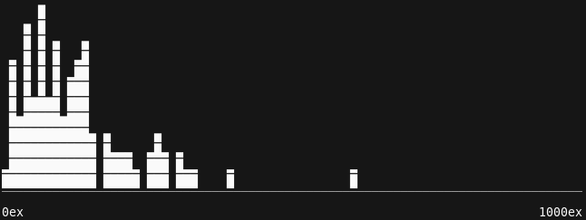

# Kalandralang

Kalandralang is a DSL (Domain-Specific programming Language) to express crafting
methods for Path of Exile, and an interpreter for this language.
The interpreter runs in the command-line. You give it a recipe source file and it
executes the recipe, showing you the final item and the total ingredient cost.
You can tell Kalandralang to execute the recipe multiple
times to get an idea of the average cost of the recipe. It even shows you
pretty graphs:

## Supported Operating Systems

Kalandralang runs on Linux. It may run on other platform, including Windows, but
no instructions are provided to get it to run on them; you're on your own.

## User Manual

The [Kalandralang User Manual](https://doomeer.github.io/kalandralang/doc/manual.html)
contains:
- [installation instructions](https://doomeer.github.io/kalandralang/doc/manual.html#installation);
- [usage instructions](https://doomeer.github.io/kalandralang/doc/manual.html#usage);
- an [example recipe](https://doomeer.github.io/kalandralang/doc/manual.html#example-recipe);
- and the full [language reference](https://doomeer.github.io/kalandralang/doc/manual.html#language-reference).

You can also find more examples in the
[examples](https://github.com/doomeer/kalandralang/tree/master/examples) directory.

## Features

Kalandralang supports:
- basic currencies;
- Eldricht currencies;
- Awakener's Orb;
- essences;
- most fossils;
- the crafting bench;
- most relevant Harvest crafts;
- beastcrafting: imprinting and splitting items;
- Betrayal crafting: Aisling;
- influenced items;
- synthesized items.

Kalandralang does not support in particular:
- unveiling;
- Hollow and Sanctified Fossils;
- Orb of Dominance;
- lucky Harvest crafts;
- "reforge more common" Harvest crafts;
- flasks (unless you like the idea of having rare flasks);
- cluster jewels;
- implicits other than Eldritch implicits.
